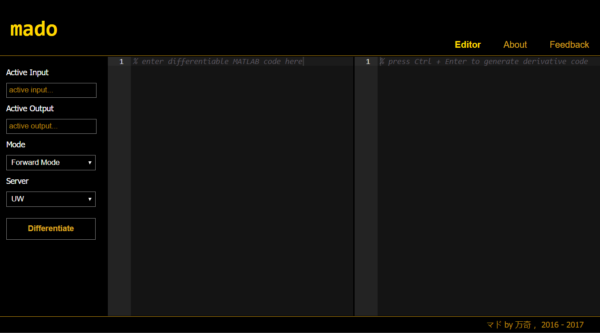
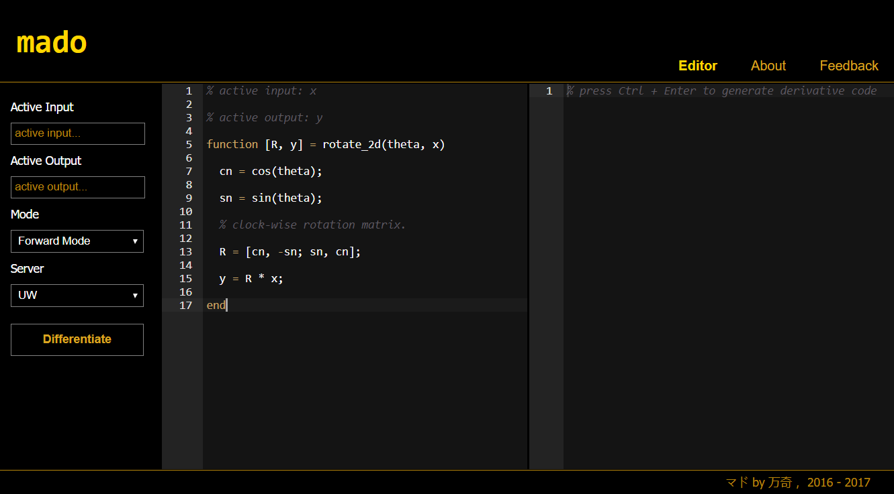
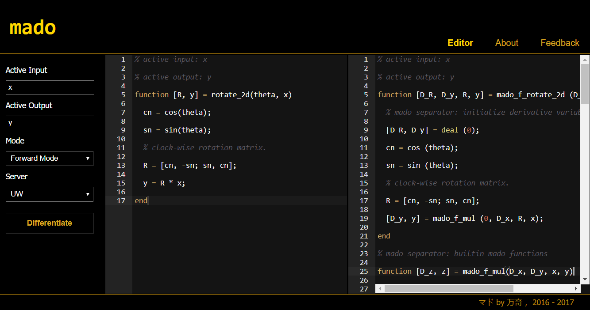

```
mado Editor User Manual

Wanqi Li 万奇

wanqi@outlook.com

last updated: July 23, 2017
```

`mado editor` ([mado-editor.net](http://mado-editor.net)) is the web interface for `mado` AD compiler.

This repository only contains the source code of `mado editor`. The source code of `mado` is to be released in the future as a separate repository after main features are stable enough. Since `mado` and `mado editor` are maintained by the same group, you can report bugs and suggest features for both `mado` and `mado editor` by opening issues in [mado-editor repository](https://github.com/vanchi7/mado-editor).

Or you can email Wanqi Li (万奇) via wanqi@outlook.com for direct contact.

This user manual assumes a basic understanding of automatic differentiation. Introduction to automatic differentiation can be found in following books.

> Coleman, T. F., & Xu, W. (2016). Automatic Differentiation in MATLAB using ADMAT with Applications. Society for industrial and applied mathematics.

> Griewank, A., & Walther, A. (2008). Evaluating derivatives: principles and techniques of algorithmic differentiation. Society for Industrial and Applied Mathematics.

# Table of Contents
<!-- TOC -->

- [Table of Contents](#table-of-contents)
- [Features](#features)
  - [Release Notes](#release-notes)
    - [July 22, 2017 - Version 0.3.2 (Current Version)](#july-22-2017---version-032-current-version)
    - [June 26, 2017 - Version 0.2.2](#june-26-2017---version-022)
    - [June 5, 2017 - Version 0.1.3](#june-5-2017---version-013)
- [Usage](#usage)
  - [MATLAB and Octave Compatibility](#matlab-and-octave-compatibility)
  - [Web Compatibility](#web-compatibility)
  - [Differentiability](#differentiability)
  - [Generate Derivative Code](#generate-derivative-code)
    - [Step 1 - Enter Differentiable Code](#step-1---enter-differentiable-code)
    - [Step 2 - Specify Parameters and Differentiate](#step-2---specify-parameters-and-differentiate)
    - [Forward Mode and Directional Derivative](#forward-mode-and-directional-derivative)
    - [Reverse Mode and Adjoint Derivative](#reverse-mode-and-adjoint-derivative)
  - [Vectorization and Structure Exploitation](#vectorization-and-structure-exploitation)
    - [Enforced Vectorization](#enforced-vectorization)
    - [Enforced Structure Exploitation](#enforced-structure-exploitation)
- [Glossary](#glossary)

<!-- /TOC -->
# Features

`mado editor` currently provides the following core features.
* forward activity analysis
* reverse activity analysis
* code linearization
* first order forward mode
* first order reverse mode
* syntax and semantic error reporting
* basic support for sparse matrix/vector
* web interface

## Release Notes

### July 22, 2017 - Version 0.3.2 (Current Version)

* added reverse activity analysis
* added forward mode
* redesigned web interface
* bug fixes and improvements

### June 26, 2017 - Version 0.2.2

* added forward activity analysis
* added code linearization
* added reverse mode
* added basic support for sparse matrix/vector
* added web interface

### June 5, 2017 - Version 0.1.3

* adaptation of and integration with parser from Octave 4.0.2
* unified error reporting for Octave related errors and AD related errors
* defined `mado` command line interface

# Usage

* Enter differentiable MATLAB code in the first editor panel of `mado editor`.
* Specify active input and output parameters in the parameter panel.
* Select forward mode or reverse mode in the parameter panel for directional derivative code or adjoint derivative code.
* Select a server accessible to you.
  * Server UW is only accessible from University of Waterloo campus network and VPN.
  * Server Alpha is currently not available.
  * Server Localhost is for local testing only.
* Press `Ctrl + Enter` or click `Differentiate` button to generate derivative code.
* If successful, derivative code will appear on the second read-only editor panel.
* If unsuccessful, error message will appear on the second read-only editor panel.

## MATLAB and Octave Compatibility

In terms of the language, Octave is a superset of MATLAB in most cases. Even though `mado` is built on Octave parser, `mado` will reject code that only works in Octave for maximum compatibility. Derivative code generated by `mado` should work in both MATLAB and Octave.

## Web Compatibility

`mado editor` is pure web-based MATLAB code editing/generation interface. `mado editor` works in main-stream web browsers on any device. No installation is required.

To test the generated code in a pure web environment on any device, user can run the generated derivative code via web interface of Octave or MATLAB
* [Octave online](https://octave-online.net/) (Free)
* [MATLAB online](https://www.mathworks.com/products/matlab-online.html)

## Differentiability

`mado` can only differentiate a limited set of MATLAB expressions. It includes all MATLAB operators with limitations specified below.
* __addition__ `z = x + y` and __subtraction__ `z = x - y`  
  where `x`, `y`, `z` cannot be active matrix, i.e. `x`, `y`, `z` must be either inactive or active scalar/row vector/column vector.
* __multiplication__ `z = x * y`  
  where `x`, `y`, `z` cannot be active matrix.
* __division__ `z = x / y`
  where `x` cannot be active matrix, `y` cannot be active vector or matrix, `z` cannot be active matrix.
* __power__ `z = x ^ y`  
  where `x`, `y` cannot be both active, and `z` must be either inactive or active scalar.
* __backslash__ `z = x \ y`  
  where `x` must be inactive and `y` cannot be active row or matrix.
* __element-wise multiplication__ `z = x .* y` and __division__ `z = x ./ y`  
  where `z` cannot be active matrix.
* __element-wise power__ `z = x .^ y`  
  where `z` cannot be active matrix.
* __element-wise left division__ `z = x .\ y`  
  where `z` cannot be active matrix.
* __plus__ `z = +x` and __minus__ `z = -x`  
  where `x`, `z` cannot be active matrix.
* __hermitian__ `z = x'` and __transpose__ `z = x.'`  
  where `x`, `z` cannot be active matrix. 

`mado` also supports some builtin MATLAB functions with limitations specified below.
* `z = abs(x)`  
  where `x` cannot be active matrix. Singular point where x equals zero is handled as if x is positive, but with warning message.
* `z = sin(x)` and `z = cos(x)`  
  where `x` cannot be active matrix.
* `z = max(x)` and `z = min(x)`  
  where `x` cannot be active matrix. `max` and `min` functions are treated as control flow to make the result differentiable. Equality is handled in consistency with the corresponding [MATLAB builtin function](https://www.mathworks.com/help/matlab/ref/max.html), where the first occurrence is selected.
* `z = max(x, y)` and `z = min(x, y)`  
  where `x`, `y`, `z` cannot be active matrix.
* `z = norm(x)`  
  where `x` cannot be active matrix.

If the MATLAB builtin function you require is not listed here, feel free to send us a feature request by creating github issue or contacting Wanqi Li （万奇） via wanqi@outlook.com directly.

Or you can provide in `mado editor` its definition as a subfunction, so that `mado` can generate their derivative code.

The example below provides the definition of function `sum`, so `mado` can generate derivative code for `sum`.

```MATLAB
function prob = normalize(x)

  prob = x / sum(x);

end

function z = sum(x)

  len = size(x,1);

  z = ones(1, len) * x;

end
```

## Generate Derivative Code

In this section, we illustrate the usage of `mado` editor with the 2D rotation function defined below

~~~MATLAB
% active input: x

% active output: y

function [R, y] = rotate_2d(theta, x)

  cn = cos(theta);
  
  sn = sin(theta);

  % clock-wise rotation matrix.
  
  R = [cn, -sn; sn, cn];

  y = R * x;
  
end
~~~

where `theta` is the rotation angle, `x` is a 2D vector, `R` is the rotation matrix of angle `theta` and `y` is the rotated 2D vector.

### Step 1 - Enter Differentiable Code



Above is the default layout of `mado editor`. There are three panels in the layout.
* __Parameter Panel__ - The first panel on the left.
  * __Active Input__ - Specify active input parameters separated by comma.
  * __Active Output__ - Specify active output parameters separated by comma.
  * __Mode__ - Select forward mode or reverse mode for directional derivative code or adjoint derivative code.
  * __Server__ - Select a `mado` server accessible to you.
    * Server UW is only accessible from University of Waterloo campus network and VPN.
    * Server Alpha is currently not available.
    * Server Localhost is for local testing only.
  * __Differentiate__ - Click this button to generate derivative code of selected mode.
* __First Editor Panel__ - The editor panel in the middle where differentiable MATLAB code is entered.
* __Second Editor Panel__ - The editor panel on the right where generated derivative code or error message is printed.

First step is to enter our differentiable 2D rotation function above in the first editor pane as follows.



### Step 2 - Specify Parameters and Differentiate

Say we are interested in the derivative of the rotated vector `y` w.r.t. the original vector `x`. We should specify in the parameter panel that `x` is active input and `y` is active output. Unspecified parameters will be considered inactive.

Depending on whether you prefer directional derivative or adjoint derivative, forward mode or reverse mode can be selected. Click `Differentiate` button or press `Ctrl + Enter` to generate derivative code. In the screenshot below, forward mode is selected.



__NOTE__:  
`mado` supports and encourages writing code with subfunctions. In that case, user only needs to specify active input and output parameters for the primary function. `mado` will infer the activity in subfunctions automatically.

### Forward Mode and Directional Derivative

If forward mode is selected, following code is generated (last two functions folded).

```MATLAB
function [D_R, D_y, R, y] = mado_f_rotate_2d (D_theta, D_x, theta, x)

  % mado separator: initialize derivative variables

  [D_R, D_y] = deal (0);

  cn = cos (theta);

  sn = sin (theta);

  % clock-wise rotation matrix.

  R = [cn, -sn; sn, cn];

  [D_y, y] = mado_f_mul (0, D_x, R, x);

end

% mado separator: builtin mado functions

function [D_z, z] = mado_f_mul(D_x, D_y, x, y)
    ...
end

% mado separator: original user code

function [R, y] = rotate_2d(theta, x)
    ...
end
```

The original function name `rotate_2d` is translated into `mado_f_rotate_2d`, where prefix `mado_f_` stands for mado forward mode.

Since forward mode is selected, directional derivative parameter with prefix `D_` are inserted to the input and output parameter lists.

To call this derivative function `mado_f_rotate_2d`, input derivative parameter must be assigned according to the specified activity.

* Derivative parameters of inactive input parameters must be set to zero.  
* Derivative parameters of active input parameters must be a directional vector of same dimensions, or a matrix of directional vectors.

Below are examples of valid and invalid call of the derivative function.

```MATLAB
% valid call

theta = pi/4;     % 45 degree angle.

x = [1, 0];       % unit vector on x axis.

D_theta = 0;      % theta is inactive.

D_x = speye(2);   % x is active with directional vectors [0;1] and [1;0].

[D_R, D_y, R, y] = mado_f_rotate_2d (D_theta, D_x, theta, x);

assert(D_R == 0, 'derivative variable of inactive output should be zero');

assert(all(size(D_y,1) == size(y,1)), 'directional derivative should have same dimension with the active output parameter');

assert(all(size(D_y,2) == size(D_x,2)), 'number of directional derivatives should equal the number of directional vectors');
```

```MATLAB
% invalid call

theta = pi/4;     % 45 degree angle.

x = [1, 0];       % unit vector on x axis.

D_theta = [1;1];  % WRONG derivative variable for inactive parameter must be zero.

D_x = rand(3,1);  % WRONG directional vector must have same dimension with the active parameter.

[D_R, D_y, R, y] = mado_f_rotate_2d (D_theta, D_x, theta, x)
```

A copy of the original function is always attached to the generated code for completeness, which might be unnecessary at times. It is up to the user whether to keep it.

In addition to the differentiated user code, the needed `mado` builtin functions will also be included in the generated code. In the above example, since the last line of the original function is an active matrix-vector multiplication expression, the builtin derivative function `mado_f_mul` for multiplication is added. The user should always keep the appended `mado` builtin functions for the generated derivative code to function.

### Reverse Mode and Adjoint Derivative

If reverse mode is selected, following code is generated (last two functions folded).

```MATLAB
function [D_theta, D_x, R, y] = mado_r_rotate_2d (D_R, D_y, theta, x)

  mado_id = 0;

  cn = cos (theta);

  sn = sin (theta);

  % clock-wise rotation matrix.

  R = [cn, -sn; sn, cn];

  mado_id = mado_id + 1;

  mado_lambda {mado_id} = @(D_y) mado_r_mul (D_y, R, x, 0, 1);

  y = R * x;

  % mado separator: reverse sweep begins

  [D_theta, D_x] = deal (0);

  [~, P_1] = mado_lambda {mado_id} (D_y);

  D_y = 0;

  D_x = D_x + P_1;

  mado_id = mado_id - 1;

end

% mado separator: builtin mado functions

function [D_x, D_y] = mado_r_mul(D_z, P_y, P_x, is_x_active, is_y_active)
    ...
end

% mado separator: original user code

function [R, y] = rotate_2d(theta, x)
    ...
end
```

The original function name `rotate_2d` is translated into `mado_r_rotate_2d`, where prefix `mado_r_` stands for mado reverse mode.

Since reverse mode is selected, adjoint derivative parameter with prefix `D_` are inserted to the input and output parameter lists.

To call this derivative function `mado_r_rotate_2d`, input derivative parameter must be assigned according to the specified activity.

* Derivative parameters of inactive output parameters must be set to zero.  
* Derivative parameters of active output parameters must be an adjoint vector of the same dimension, or a matrix of adjoint vectors.

Below are examples of valid and invalid call of the derivative function.

```MATLAB
% valid call

theta = pi/4;    % 45 degree angle.

x = [1, 0];      % unit vector on x axis.

D_R = 0;         % R is inactive.

D_y = speye(2);  % y is active with adjoint vectors [0;1] and [1;0].

[D_theta, D_x, R, y] = mado_r_rotate_2d (D_R, D_y, theta, x);

assert(D_theta == 0, 'derivative variable of inactive input should be zero');

assert(all(size(D_x,1) == size(x,1)), 'adjoint derivative should have same dimension with the active input parameter');

assert(all(size(D_x,2) == size(D_y,2)), 'number of adjoint derivatives should equal the number of adjoint vectors');
```

```MATLAB
% invalid call

theta = pi/4;    % 45 degree angle.

x = [1, 0];      % unit vector on x axis.

D_R = speye(2);  % WRONG adjoint variable for inactive parameter must be zero.

D_y = rand(3);   % WRONG adjoint vector must have same dimension with the active parameter.

[D_theta, D_x, R, y] = mado_r_rotate_2d (D_R, D_y, theta, x);
```

A copy of the original function is always attached to the generated code for completeness, which might be unnecessary at times. It is up to the user whether to keep it.

In addition to the differentiated user code, the needed `mado` builtin functions will also be included in the generated code. In the above example, since the last line of the original function is an active matrix-vector multiplication expression, the builtin derivative function `mado_r_mul` for multiplication is added. The user should always keep the appended `mado` builtin functions for the generated derivative code to function.

## Vectorization and Structure Exploitation

The first principle `mado` is the enforcement of  vectorization and structure exploitation.

### Enforced Vectorization

MATLAB is designed for highly vectorized code, for which all CPU cores can be utilized. MATLAB performs badly when code is not vectorized enough, for which most of the time CPU can only process data sequentially.

To enforce vectorization, `mado` does not allow indexing operation on active variables. That is, `mado` regard vector as the atomic differentiation object. User code that applies indexing operation on active variables is regarded as non-differentiable by `mado`.

```MATLAB
% assume x is a column vector.

% following implementation is differentiable because it complies vectorization.

function z = sum(x)

  len = size(x,1);

  z = ones(1, len) * x;

end

% following implementation is non-differentiable because it breaks vectorization.

function z = sum(x)

  z = 0;

  for i = 1:size(x,1);

    z = z + x(i, :);

  end

end
```

### Enforced Structure Exploitation

The space complexity of plain reverse mode is proportional with the time complexity of the primary computation. This makes reverse mode hardly applicable to problem of significant scale. This issue can be dealt with by structure exploitation with checkpointing, a divide-and-conquer approach of reverse mode.

To enforce structure exploitation, `mado` does not allow nested for-loop inside function body. Nested for-loop can only be implemented with subfunction as follows.

```MATLAB

% active input: x

% active output: avg

function avg = monte_carlo_average(x, N, M)

  for inst = 1:N

    p = monte_carlo_instance(x, M);

    avg = avg + p / N;

  end

end

function p = monte_carlo_instance(x, M)

  len = numel(len);

  for t = 1:M

    w = rand(len, 1);

    x = w .* x;

  end

  p = max(x);

end
```

Because the inner loop is implemented as subfunction `monte_carlo_instance`, at each outer iteration, all its intermediate variables are released, so the space complexity is reduced to be proportional with the time complexity of the inner loop function `monte_carlo_instance`, instead of the entire computation.

# Glossary

* __AD__  
  Abbreviation of Automatic Differentiation. AD refers to a combination of algorithms that  
  1. determine the activity of intermediate variables given active input and output parameters;
  2. determine if user code is differentiable;
  3. and, if differentiable, generate derivative code for all active expressions.
* __Activity__
  * __Active Input/Output Parameters__  
  Let `function [u, v] = f(x, y)` be a differentiable MATLAB function. Say we want to compute the derivative `dv/dy` and we are not interested in derivatives `du/dx, du/dy, dv/x`, then we say `x` is inactive input parameter; `y` is active input parameter; `u` is inactive output parameter; `v` is active output parameter. We only need to generate derivative code for values that are related to active input and output parameters.
  * __Active Intermediate Variables__  
  Consider the implementation of the above function  
    ```MATLAB
    % active input: y
    % active output: v
    function [u, v] = f(x, y)

      [t1, t2] = op1(x, y); % inactive

      [h1, h2] = op2(x, y); % active

      u = op3(t1, t2);      % inactive

      v = op4(h1, h2);      % inactive

    end
    ```  
    Variables defined by binding parameter names with input values are called input arguments. Variables whose values are returned by the function are called output arguments. Variables defined in the body of a function are called intermediate variables. An intermediate variable is active only if its value depends on some active input argument and some active output argument depends on its value.  
    In the above example, `t1` and `t2` are inactive because even though they depend on active input argument `y`, their values does not affect the value of active output arguments. `h1` and `h2`, on the other hand, are active because they both depend on active input argument `y` and their values are required by active output argument `v`.
  * __Active Expressions__  
    An expression is active if both its left hand side and right hand side are active. Only assignment expression can be active. To compute the required derivative, we only need to generate derivative code for active expressions.
* __Differentiable__  
  A MATLAB function is differentiable if every active expression is differentiable. An active expression is differentiable its implied mathematical function is differentiable.
* __Derivative Code__  
  The derivative code of a differentiable MATLAB function computes the derivatives of active output parameters w.r.t. active input parameters.
* __Directional Derivative__  
  Denote `J` the Jacobian matrix of function `f`. Let `d` be any directional vector on the manifold of active input parameters and `D` a matrix whose columns are direction vectors. Directional derivative on direction `d` or directions `D` is defined as `J*d` or `J*D`.
* __Adjoint Derivative__  
  Denote `J` the Jacobian matrix of function `f`. Let `w` be any adjoint vector on the manifold of active output parameters and `W` a matrix whose rows are adjoint vectors. Adjoint derivative against adjoint vector `w` or adjoint vectors `W` is defined as `w*J` or `W*J`.
* __Forward Mode__  
  Forward mode refers to the algorithms that generate derivative code capable of computing arbitrary directional derivatives of active parameters.
* __Reverse Mode__  
  Reverse mode refers to the algorithms that generate derivative code capable of computing arbitrary adjoint derivatives of active parameters.